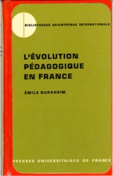

# L'Évolution pédagogique en France

Émile Durkheim, *L’évolution pédagogique en France
Cours pour les candidats à l’Agrégation prononcé en 1904-1905.*, Paris 1938.

L'ouvrage a été numérisé par Jean-Marie Tremblay pour le site _Les Classiques des sciences sociales_ ([doi](http://dx.doi.org/doi:10.1522/cla.due.evo)).

Cette version peut contenir des erreurs de numérisation. Vous pouvez proposer des corrections directement sur [Github](https://github.com/opensciencessociales/evolution_pedagogique). En cas de doute, on peut se référer à la version mise en ligne sur [Gallica](http://gallica.bnf.fr/ark:/12148/bpt6k57892738/f14.image.r=durkheim.langFR).

L'ouvrage est désormais dans le domaine public.
